# 智慧实验室系统架构图集

## 1. 整体架构图（本地化轻量级版）

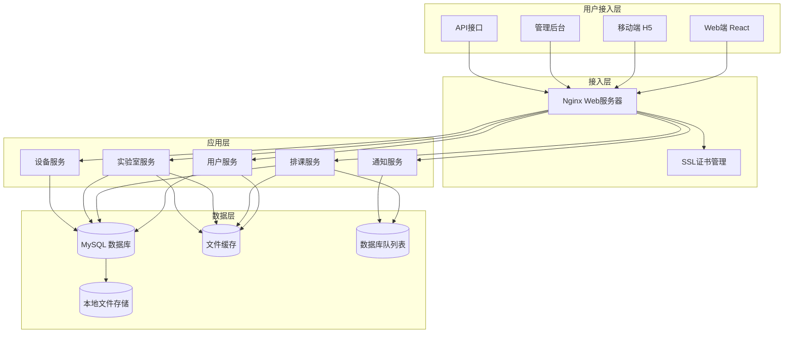

## 2. 智能排课系统架构图（本地化适配版）

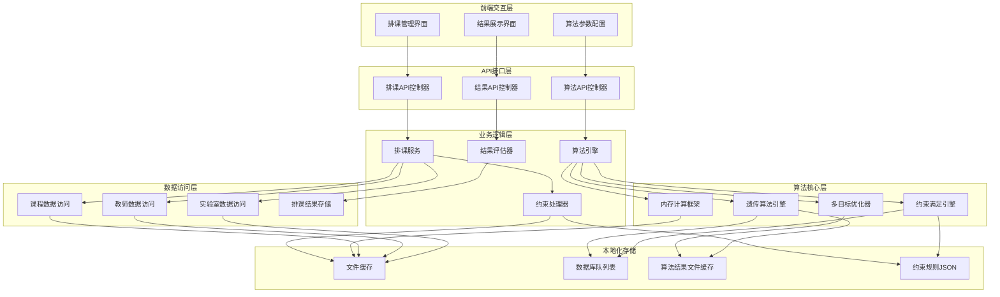

## 3. 数据库架构图

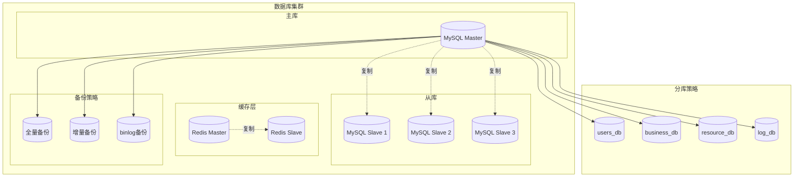

## 4. 微服务架构图

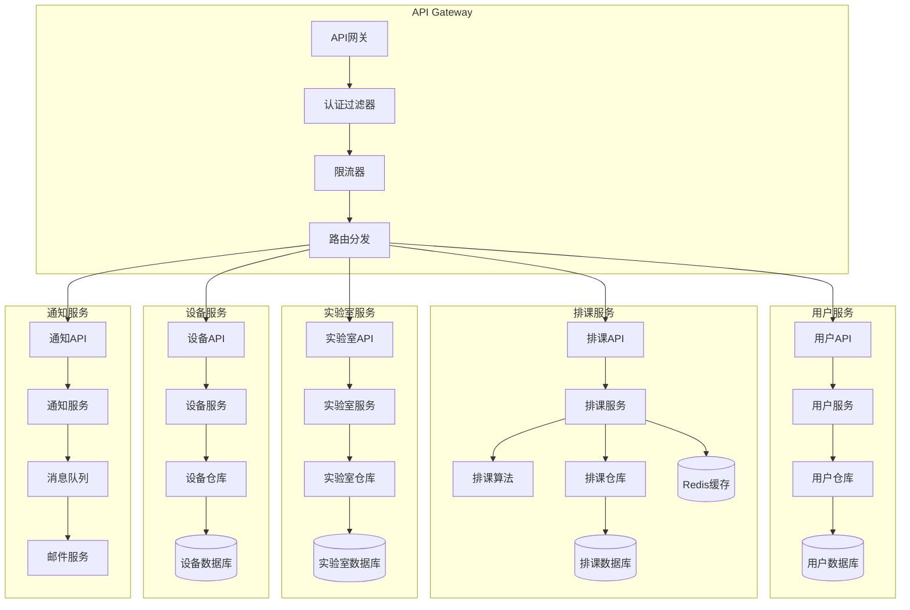

## 5. 安全架构图

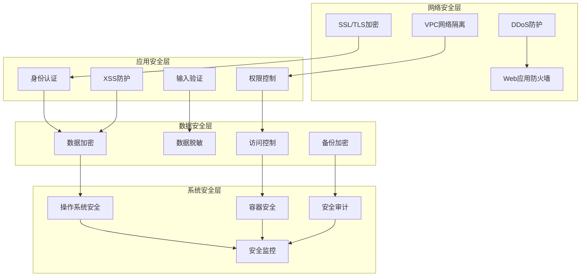

## 6. 部署架构图

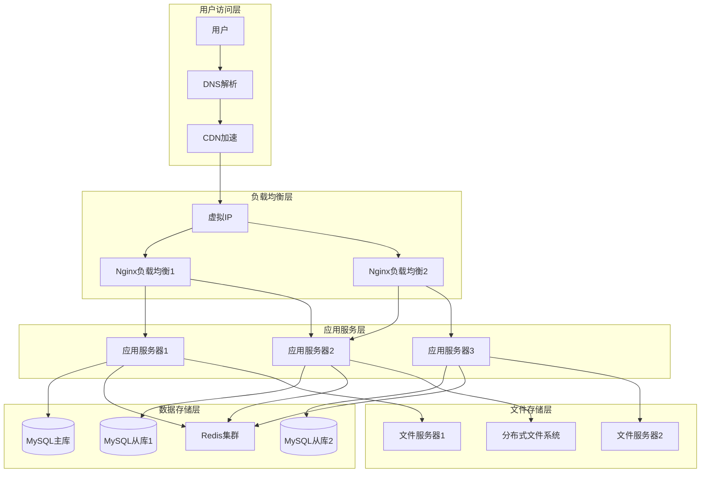

## 7. 智能排课算法流程图

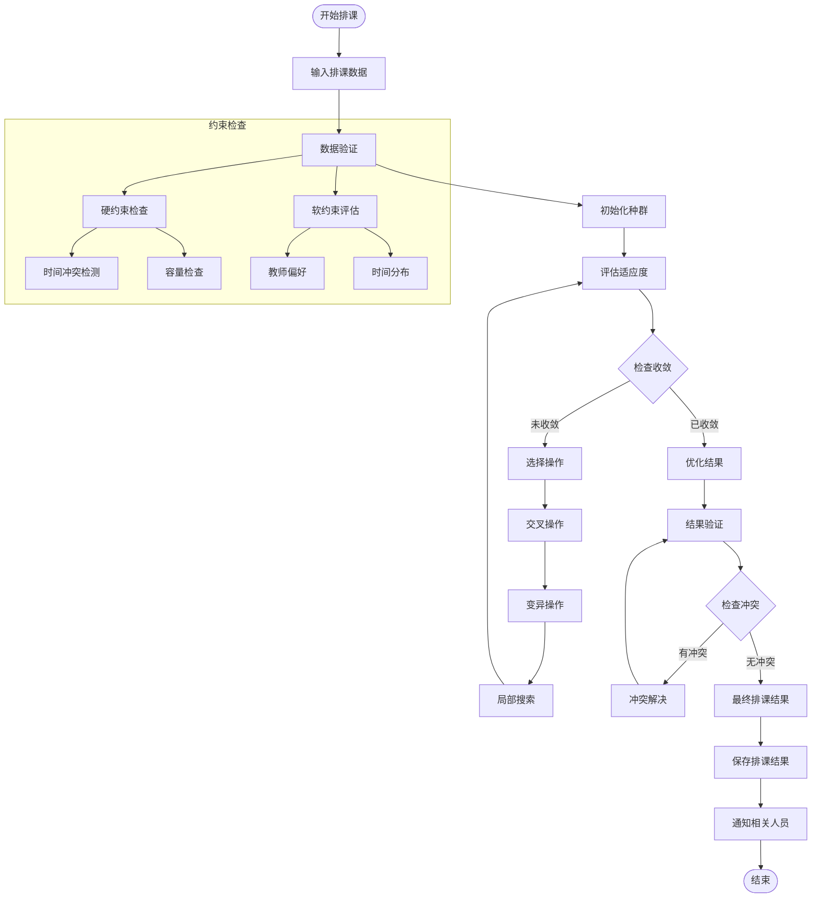

## 8. 系统时序图

### 用户登录时序图
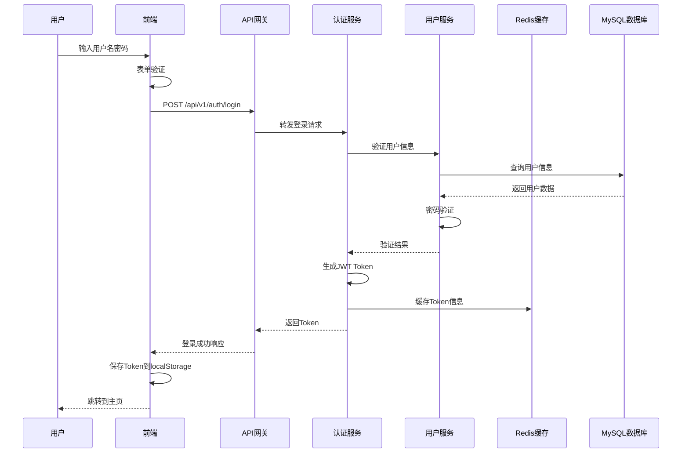

### 智能排课时序图
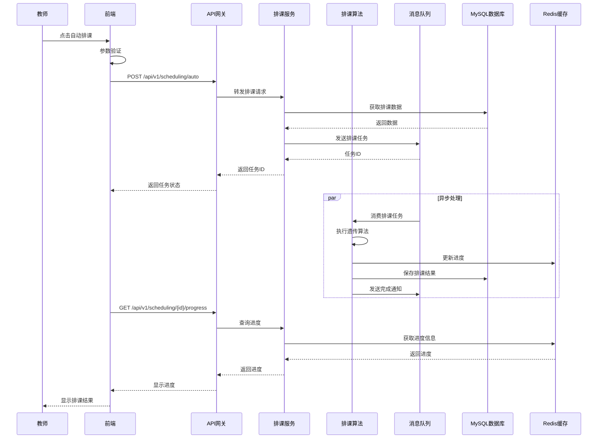

## 9. 数据流图

### 排课数据流图
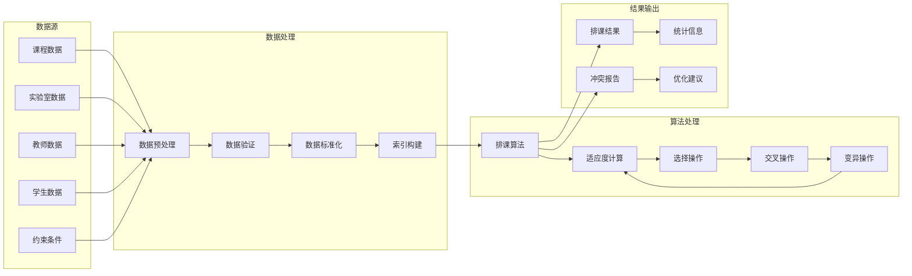

## 10. 网络拓扑图

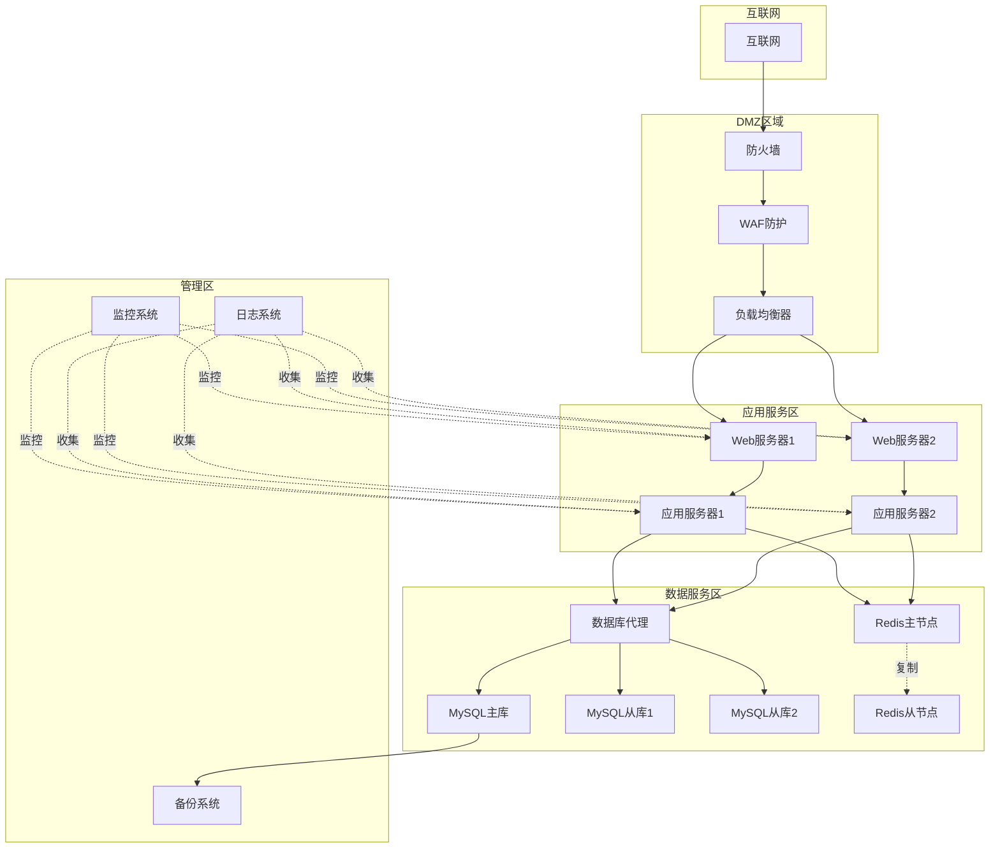

这些架构图清晰展示了智慧实验室系统的整体架构设计，包括系统分层、微服务架构、数据库设计、安全架构、部署方案等关键组成部分。通过可视化的方式，帮助开发团队和项目相关方更好地理解系统架构，为后续的开发实施提供清晰的指导。